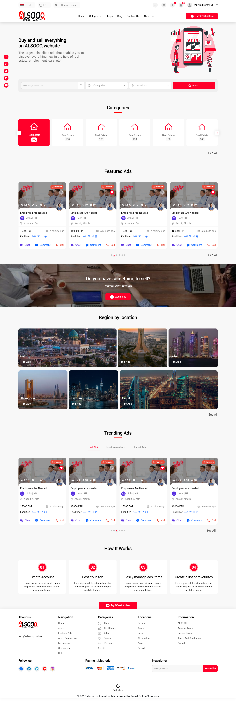
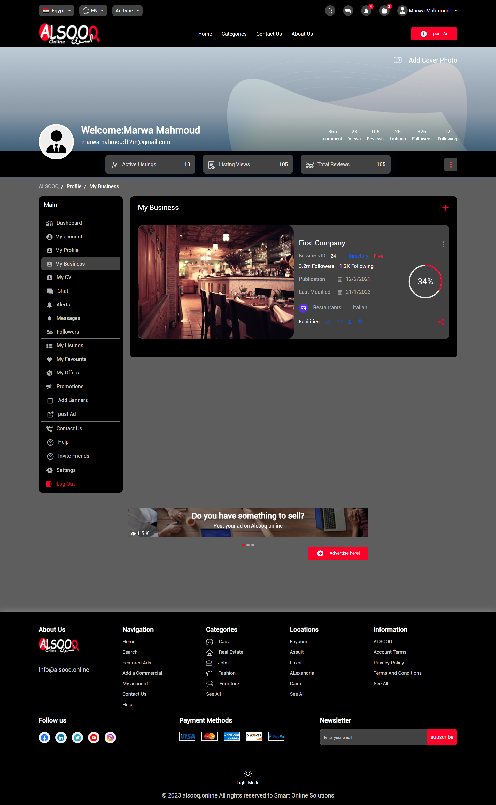
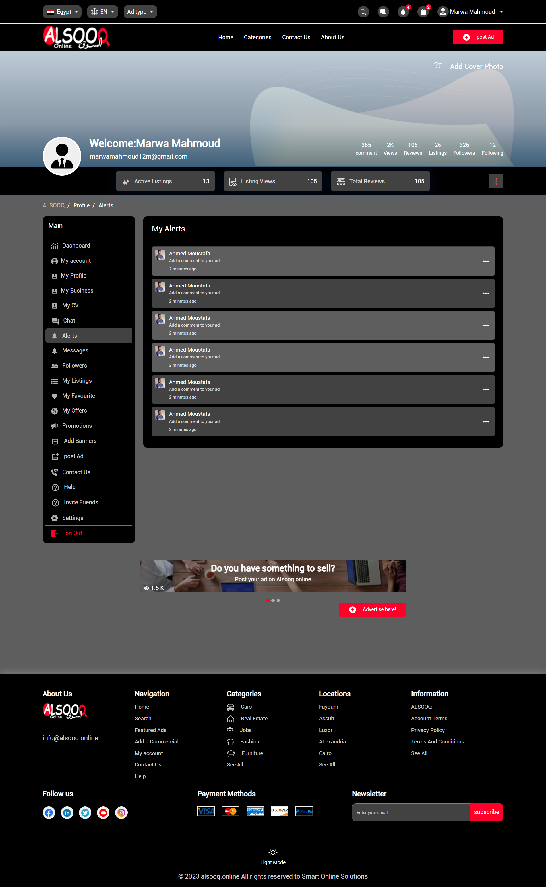
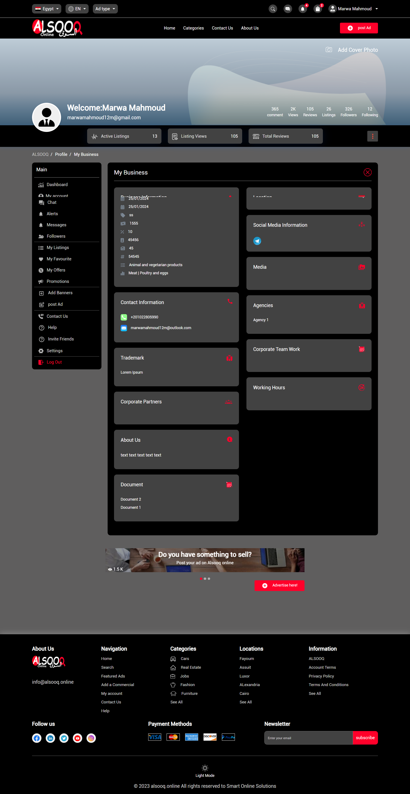

# 🛍️ Alsooq: Multi-Vendor Commercial Platform (2023)
### Advanced Angular 16 Business Management Solution (Frontend Implementation)

 

  

  <strong>Note:</strong> <i>You can find more screenshots showcasing different modules and the Dark Mode in the <a href="./Gallery">Gallery</a> folder.</i>

 

  
  
  
  

---

## 📝 Project Overview
**Alsooq** is a sophisticated multi-vendor commercial platform developed in **2023** during my tenure at **Smart Online Solutions**. The platform serves as a centralized hub for businesses to manage their profiles, services, and commercial activities through an interactive and high-performance dashboard.

As a **Senior Software Engineer**, I was responsible for transforming complex business requirements into a responsive, user-centric interface, ensuring a seamless experience across all devices and implementing advanced features like dual-theme support.

---

## 🚀 Technical Highlights & Features

### 1️⃣ Advanced Dashboard & Data Visualization
* **Dynamic Analytics**: Integrated **CanvasJS Angular Charts** to provide vendors with real-time visual insights into their business performance.
* **Enterprise Data Tables**: Utilized **Angular Datatables** for efficient handling and filtering of large business datasets.
* **Interactive Mapping**: Integrated **@angular/google-maps** for location-based business discovery and management.

### 2️⃣ Custom Theme Engine (Dark & Light Mode)
* Engineered a robust **Theme-Switching System** using **SASS/SCSS variables** and Angular Services to manage and persist user theme preferences.
* Optimized all UI components (Charts, Tables, and Forms) for visual consistency in both modes.

### 3️⃣ Complex Business Logic & UX
* **Reactive Forms**: Developed intricate forms for business registration and "Edit My Business" modules with real-time validation.
* **Modern Components**: Integrated **Swiper** for product sliders, **ngx-dropzone** for intuitive file uploads, and **ng-circle-progress** for tracking user registration steps.

---

## 🛠️ Technical Stack
* **Framework**: Angular 16 (TypeScript).
* **UI & Components**: Angular Material, Bootstrap 5, @ng-bootstrap.
* **Visualization**: CanvasJS Angular Charts, Google Maps JavaScript API.
* **Tools & Libraries**: FontAwesome 6, Swiper, Ngx-dropzone, Angular Datatables.

---

## 🖼️ Visual Showcase
*(Check the [Gallery](./Gallery) folder for the full set of high-resolution images)*

  

  
  

---

## 👤 My Role & Contribution
* Led the **Frontend Development** lifecycle from component architecture to API integration.
* Implemented the **State Management** for theme switching and user session preferences.
* Optimized frontend performance to ensure smooth interactions with heavy data-driven components.

---

## 📩 Contact & Professional Profiles
**Marwa Mahmoud Mohamed** Senior Software Engineer  

📧 **Email**: [marwa.sw.eng@outlook.com](mailto:marwa.sw.eng@outlook.com)  
🔗 **LinkedIn**: [marwa-mahmoud123](https://www.linkedin.com/in/marwa-mahmoud123)  
💻 **Portfolio**: [marwa-mahmoud-sw-eng.vercel.app](https://marwa-mahmoud-sw-eng.vercel.app/)

---
*Disclaimer: This repository is a technical showcase of the frontend implementation. Source code and assets are proprietary to Smart Online Solutions.*
